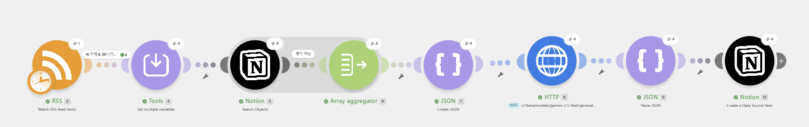

# 워크플로우 설계서

> **산출물 1** — 워크플로우 구조, 각 단계별 역할과 연결 구조
> 이 문서는 **실제 구축된 시나리오 기준**으로 작성되었습니다. 모듈 번호는 캔버스 표시와 동일합니다.

## 1. 전체 구조




## 2. 데이터 흐름 한 줄 요약

**RSS n건** → (주제 필터) **AI 기사** → (중복 필터) **신규 기사** → (건별 요약) **요약** → **Notion 행**

핵심은 **비싼 단계를 뒤로 미는 순서**입니다. 무료인 필터링(A)과 DB 조회(5·6)를 앞에 두고, 유료인 AI 호출(8)을 뒤에 배치했기 때문에 중복 기사나 비주제 기사에는 요약 비용이 한 푼도 들지 않습니다.

---

## 3. 모듈별 상세

### 트리거 — 스케줄

Make에서 스케줄은 별도 모듈이 아니라 **시나리오 속성**입니다. 캔버스 좌측 하단 시계 아이콘 → `Every day` / `08:00` / 타임존 `Asia/Seoul`.

| 항목 | 값 | 이유 |
|---|---|---|
| 실행 주기 | 매일 1회 | 요구사항 |
| 실행 시각 | 08:00 KST | 전날 오후~밤 기사가 모두 색인된 뒤이면서, 팀이 출근해 결과를 확인할 수 있는 시각 |
| 타임존 | Asia/Seoul | 계정 프로필 기본값이 UTC라 그대로 두면 실제로는 17:00에 실행됨 |

---

### 모듈 2 — RSS: Watch RSS feed items

**역할** — 피드를 읽어 기사 1건당 bundle 1개를 만들어 흘려보냅니다. 이후 모든 모듈은 **기사 1건 단위로 반복 실행**됩니다.

| 설정 | 값 |
|---|---|
| URL | `https://rss.etnews.com/03.xml` |
| Maximum number of returned items | `3` (실전) / `1` (테스트 중) |

**왜 `Watch`(폴링)이고 `Retrieve`(전체 조회)가 아닌가**
`Watch` 계열 모듈은 마지막으로 처리한 항목을 Make가 기억해, 다음 실행 때 **그 이후 항목만** 내보냅니다. 즉 트리거 자체가 1차 중복 방지 역할을 합니다. `Retrieve`를 쓰면 매일 같은 기사를 전부 받아 필터가 헛돌게 됩니다.

**주요 출력 필드**

| 필드 | 매핑 표기 | 용도 |
|---|---|---|
| Title | `{{2.title}}` | Notion 제목, 요약 입력 |
| URL | `{{2.url}}` | Notion 원본 링크, **중복 키의 원재료** |
| Description | `{{2.description}}` | 요약 입력 (300~420자 확보됨) |
| Date created | `{{2.dateCreated}}` | Notion 발행일시, 신선도 필터 |

> **`Choose where to start`** — 모듈 우클릭으로 시작 지점을 바꿀 수 있습니다. `All`을 고르면 **가장 오래된 항목부터** 시간순으로 처리하므로(항목 누락 방지 설계), 최신 기사로 테스트하려면 `Choose manually`로 직접 골라야 합니다. 실전 전환 시에는 `From now on`으로 설정합니다.

---

### 필터 A — AI 주제 & 신선도

**역할** — 관심 없는 기사를 여기서 끊습니다. Make의 필터는 모듈이 아니라 **연결선 위의 조건**이며, 통과하지 못한 bundle은 그 자리에서 조용히 사라집니다(에러 아님).

| # | 대상 | 연산자 | 값 |
|---|---|---|---|
| A-1 | `{{lower(2.title)}} {{lower(2.description)}}` | Text: `Matches pattern` | 소문자 키워드 정규식 (README §2-1) |
| A-2 | `{{2.dateCreated}}` | Datetime: `Later than` | `{{addHours(now; -36)}}` |

**설계 포인트 3가지**

1. **제목과 본문을 공백 하나로 이어 붙여 한 번에 검사.** 조건을 둘로 나누면 OR 그룹이 필요해져 복잡해지는데, 이어 붙이면 "제목에 없어도 본문에 있으면 통과"가 자연히 만족됩니다.
2. **`lower()`로 감싸는 것이 필수.** Make의 정규식은 JavaScript 엔진이라 `(?i)` 인라인 플래그를 지원하지 않습니다. 대소문자 무시는 검사 대상과 패턴 **양쪽을 소문자로 맞춰서** 구현합니다. 이걸 빼면 기사에 `AI`가 대문자로 쓰인 경우 소문자 패턴 `ai`와 매칭되지 않아, **AI 키워드 그룹 전체가 무력화**됩니다.
3. **`length()`와 `lower()`를 혼동하지 말 것.** 구축 중 실제로 발생한 실수입니다. `length(title)`을 넣으면 제목이 글자 수 숫자로 바뀌어 검사에서 통째로 빠지는데, 에러가 나지 않아 발견이 늦습니다.

**A-2 조건 운영 메모** — 구축 단계에서는 이 조건이 오래된 테스트 기사를 전부 막아 진행을 방해하므로, 파이프라인 전체를 검증하는 동안 일시 제거했다가 마지막에 복원했습니다. 조건을 하나씩 떼어 원인을 좁히는 것이 Make 필터 디버깅의 기본입니다. 필터 인스펙터에서 조건별 ✅/🚫/◎(미평가) 아이콘으로 어느 조건이 막고 있는지 확인할 수 있습니다.

---

### 모듈 4 — Tools: Set multiple variables

**역할** — 이후 모듈이 반복해서 쓸 파생 값을 한 곳에서 계산합니다. 같은 수식을 여러 모듈에 흩어 놓으면 나중에 한 군데만 고치는 실수가 납니다.

| 변수 | 수식 | 용도 |
|---|---|---|
| `link_hash` | `{{sha256(2.url)}}` | 중복 방지 키 |
| `feed_name` | `전자신문 IT` | 출처 표기 (Notion `출처` 속성 사용 시) |

**왜 URL 자체가 아니라 해시인가**
① URL은 길이 제한이 없고 쿼리 파라미터(`?utm_source=...`)가 붙으면 같은 기사인데 다른 문자열이 됩니다. ② 해시는 항상 64자 고정이라 Notion 텍스트 속성에서 비교가 안정적입니다. ③ 과제 요구사항이 명시한 "원문 링크 해시" 방식에 그대로 해당합니다.

> **`pub_iso` 변수는 폐기했습니다.** 처음에는 `formatDate()`로 ISO 문자열을 만들어 Notion에 넘기려 했으나, Make의 Notion 모듈이 **날짜 타입 값을 직접 받아 스스로 타임존을 적용**하는 구조라 미리 가공한 문자열은 `Invalid date` 오류를 냅니다. 원본 필드 `{{2.dateCreated}}`를 그대로 넘기는 것이 정답입니다. (모듈 13 참고)

---

### 모듈 5 — Notion: Search Objects

**역할** — 이 해시가 DB에 이미 있는지 조회합니다.

| 설정 | 값 |
|---|---|
| Search Objects | `Data Source Items` |
| Data Source ID | `AI 뉴스 아카이브 DB` |
| Filter | `링크해시` / `Text: Equals` / `{{4.link_hash}}` |
| Limit | `1` |

찾으면 bundle 1개, 없으면 **bundle 0개**를 내보냅니다. 그런데 Make에서 bundle 0개는 "이후 모듈이 아예 실행되지 않음"을 뜻하므로, 이대로는 "없을 때 저장" 로직을 만들 수 없습니다. 그래서 모듈 6이 필요합니다.

> **Legacy가 아닌 `Data Source` 계열을 선택했습니다.** Notion API가 "하나의 데이터베이스가 여러 데이터 소스를 가질 수 있는" 구조로 개편되면서 Make가 모듈을 새로 만들었고, `(Legacy)` 모듈은 향후 중단 예정입니다. 조회(5)와 저장(13)을 같은 계열로 통일해야 필드 스키마가 일치합니다.

---

### 모듈 6 — Flow Control: Array aggregator

**역할** — **0개든 1개든 반드시 bundle 1개로 만들어 주는 변환기.**

| 설정 | 값 |
|---|---|
| Source Module | `5. Notion – Search Objects` |
| Aggregated fields | `Page ID` (아무 필드나 하나) |

집계 후 `{{6.array}}`의 길이를 보면 조회 결과 개수를 알 수 있습니다. 0이면 신규, 1 이상이면 중복입니다.

> **`Tools`가 아니라 `Flow Control` 그룹에 있습니다.** Tools 안의 `Numeric/Table/Text aggregator`는 값을 합계·표·문자열로 묶는 용도라 목적이 다릅니다.
>
> **필터 B는 이 모듈 *뒤* 연결선에 걸어야 합니다.** 앞에 걸면 `references inaccessible module` 오류가 납니다 — 아직 실행되지 않은 모듈의 출력을 참조할 수 없기 때문입니다.

---

### 필터 B — 중복 아님

| 대상 | 연산자 | 값 |
|---|---|---|
| `{{length(6.array)}}` | Numeric: `Equal to` | `0` |

여기를 통과한 기사만 유료 AI 호출로 넘어갑니다. **이 필터의 위치가 곧 비용 정책입니다.**

---

### 모듈 7 — JSON: Create JSON

**역할** — 프롬프트 텍스트를 JSON 안전 형태로 감쌉니다.

| 설정 | 값 |
|---|---|
| Data structure | `gemini_part` — 필드 **하나**: `text` (Text, Required) |
| `text` | 프롬프트 전문 ([../assets/prompt.md](../assets/prompt.md)) |

**왜 이 모듈이 필요한가**
기사 제목·본문에는 큰따옴표(`"`), 줄바꿈, 역슬래시가 섞여 있습니다. 이것을 HTTP 모듈의 raw JSON 본문에 그대로 끼워 넣으면 JSON 구조가 깨져 `400 Bad Request`가 납니다. 어제까지 잘 되다가 특정 기사에서만 갑자기 실패하는, 원인 찾기 가장 어려운 종류의 버그입니다. `Create JSON`은 매핑된 값을 자동으로 이스케이프하므로 이 문제가 구조적으로 발생하지 않습니다.

**왜 요청 본문 전체가 아니라 `text` 필드 하나만 만드는가**
사용자 입력이 섞이는 부분은 프롬프트 하나뿐이고, 나머지(`generationConfig`, `responseSchema`)는 값이 변하지 않는 고정 설정이라 이스케이프 문제가 없습니다. 게다가 이 모듈의 출력 `{{7.json}}`은 정확히 `{"text": "..."}` 형태인데, 이것이 **Gemini API의 `parts` 배열 원소 형태와 그대로 일치**합니다. 그래서 모듈 8에서는 `"parts": [ {{7.json}} ]`이라고 쓰기만 하면 조립이 끝납니다.

---

### 모듈 8 — HTTP: Make a request (Gemini)

**역할** — 요약·감성·키워드를 **한 번의 호출로** 받아옵니다.

| 설정 | 값 |
|---|---|
| Authentication type | `None` (인증은 헤더로 처리) |
| URL | `https://generativelanguage.googleapis.com/v1beta/models/gemini-2.5-flash:generateContent` |
| Method | `POST` |
| Header 1 | `x-goog-api-key` : `(API 키)` |
| Header 2 | `Content-Type` : `application/json` |
| Body content type | `application/json` |
| Body input method | `JSON string` |
| Body content | [../assets/gemini-request-body.txt](../assets/gemini-request-body.txt) |
| Parse response | ✅ `Yes` |

**핵심 설계 ① — 구조화 출력(Structured Output)**

요청 본문의 `generationConfig.responseSchema`에 응답 형태를 못 박아 두었습니다. 그래서 Gemini는 자유 문장이 아니라 반드시 아래 형태로만 답합니다.

```json
{ "summary": "...", "sentiment": "긍정", "keywords": ["...", "...", "..."] }
```

이 한 가지 설계가 세 가지를 동시에 해결합니다.

1. **파싱 불필요** — "요약: ~" 같은 텍스트에서 정규식으로 뽑아낼 필요가 없습니다.
2. **호출 1회 원칙 충족** — 요약·감성분석·키워드를 각각 호출하면 3회지만, 한 스키마에 담으면 1회입니다. (보너스 2를 추가 비용 0으로 달성)
3. **감성 값 고정** — `enum: ["긍정","중립","부정"]`으로 제한해, Notion Select 속성에 없는 값이 들어와 저장이 실패하는 사고를 막습니다.

---

### 모듈 9 — JSON: Parse JSON

**역할** — Gemini 응답 안에 **문자열로 들어 있는** 결과 JSON을 실제 객체로 바꿉니다.

| 설정 | 값 |
|---|---|
| JSON string | `{{8.data.candidates[1].content.parts[1].text}}` |
| Data structure | `gemini_result` (summary / sentiment / keywords) |
| Strict | `No` |

> ⚠️ **Make의 배열 인덱스는 1부터 시작합니다.** 다른 언어 습관대로 `candidates[0]`이라고 쓰면 값이 비어 있는데 에러도 안 나서 원인을 못 찾습니다.

`Strict`를 `No`로 둔 이유: 응답 형식은 이미 `responseSchema`가 API 레벨에서 강제하고 있습니다. 여기서 한 번 더 조이면 검증만 이중이 되고 실패 지점만 늘어납니다.

응답 구조가 이중으로 감싸여 있는 이유: 바깥은 Gemini API의 공통 응답 봉투(candidates/content/parts), 안쪽 `text`가 우리가 스키마로 요청한 결과입니다.

---

### 모듈 13 — Notion: Create a Data Source Item

**역할** — 최종 저장.

| Notion 속성 | 타입 | 매핑 값 |
|---|---|---|
| 제목 | Title | `{{2.title}}` |
| 요약 | Text | `{{9.summary}}` |
| 원본 링크 | URL | `{{2.url}}` |
| 발행일시 | Date | `{{2.dateCreated}}` + `Include Time: Yes` |
| 링크해시 | Text | `{{4.link_hash}}` |
| 감성 | Select | `{{9.sentiment}}` (Map 토글 ON) |
| 키워드 *(선택)* | Multi-select | `{{9.keywords}}` (Map 토글 ON) |
| 출처 *(선택)* | Select | `{{4.feed_name}}` (Map 토글 ON) |

**날짜 매핑 주의** — `Start Time`에 `formatDate()`로 만든 ISO 문자열을 넣으면 `Invalid date in parameter 'start'` 오류가 납니다. 필드 아래 `Time zone: Asia/Seoul` 표기가 말해주듯 이 모듈은 **날짜 타입 값을 받아 스스로 변환**하므로, 원본 `{{2.dateCreated}}`를 그대로 넘겨야 합니다.

**`Include Time`을 `Yes`로** — 기본값 `No`로 두면 시각이 잘려 "발행 일시"가 아니라 "발행 일자"가 됩니다.

**Select/Multi-select 매핑** — 속성 옆 `Map` 토글을 켜야 동적 값을 넣을 수 있습니다. 꺼져 있으면 미리 정의된 옵션 중 고정값만 선택 가능합니다.

---

