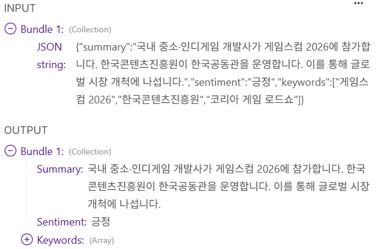
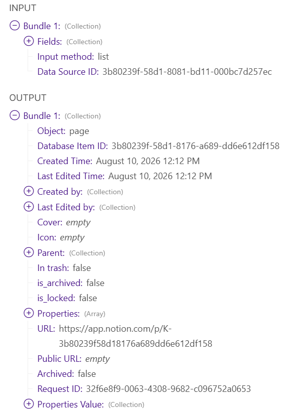

# 워크플로우 설계서

> **산출물 1** — 워크플로우 구조, 각 단계별 역할과 연결 구조
> 이 문서는 **실제 구축된 시나리오 기준**으로 작성되었습니다. 모듈 번호는 캔버스 표시와 동일합니다.

## 1. 전체 구조


## 2. 데이터 흐름 한 줄 요약

**RSS n건** → (주제 필터) **AI 기사** → (중복 필터) **신규 기사** → (건별 요약) **요약** → **Notion 행**

---

## 3. 모듈별 상세

### 트리거 — 스케줄

Make에서 스케줄은 별도 모듈이 아니라 **시나리오 속성**입니다. 캔버스 좌측 하단 시계 아이콘 → `Every day` / `08:00` / 타임존 `Asia/Seoul`.

| 항목 | 값 | 이유 |
|---|---|---|
| 실행 주기 | 매일 1회 | 요구사항 |
| 실행 시각 | 08:00 KST | 전날 오후~밤 기사가 모두 색인된 뒤이면서, 팀이 출근해 결과를 확인할 수 있는 시각 |
| 타임존 | Asia/Seoul | 계정 프로필 기본값이 UTC라 그대로 두면 실제로는 17:00에 실행됨 |

---

### 모듈 2 — RSS: Watch RSS feed items

**역할** — 피드를 읽어 기사 1건당 bundle 1개를 만들어 흘려보냅니다. 이후 모든 모듈은 **기사 1건 단위로 반복 실행**됩니다.

| 설정 | 값 |
|---|---|
| URL | `https://rss.etnews.com/03.xml` |
| Maximum number of returned items | `3` (실전) / `1` (테스트 중) |


**주요 출력 필드**

| 필드 | 매핑 표기 | 용도 |
|---|---|---|
| Title | `{{2.title}}` | Notion 제목, 요약 입력 |
| URL | `{{2.url}}` | Notion 원본 링크, **중복 키의 원재료** |
| Description | `{{2.description}}` | 요약 입력 (300~420자 확보됨) |
| Date created | `{{2.dateCreated}}` | Notion 발행일시, 신선도 필터 |

**실행 결과**


기사 1건이 bundle 1개로 만들어진 모습입니다. 이후 모든 모듈이 이 bundle 하나를 넘겨받아 순차 처리합니다.

- `Description`과 `Summary`가 **같은 내용**입니다. 전자신문 피드는 두 필드에 동일한 발췌문을 넣기 때문에, 요약 입력으로는 `Description` 하나만 쓰면 충분합니다.
- 본문 발췌가 약 300자로 끝나 있습니다(`…국내 중소 게임·콘텐츠`). **원문 전체가 아니라 도입부만 제공**된다는 뜻인데, 3줄 요약에는 도입부만으로 충분하므로 원문 크롤링 단계를 두지 않은 근거가 됩니다.
- `RSS fields` 하위에 `guid`가 별도로 존재합니다. 중복 키를 URL 해시 대신 `guid`로 잡는 선택지도 있었으나, `guid`는 매체마다 형식이 제각각이라 피드를 교체하면 규칙이 깨집니다. URL 해시는 어느 피드에서든 동일하게 동작합니다.

---

### 필터 A — AI 주제 & 신선도

**역할** — 관심 없는 기사를 여기서 끊습니다. Make의 필터는 모듈이 아니라 **연결선 위의 조건**이며, 통과하지 못한 bundle은 그 자리에서 조용히 사라집니다(에러 아님).

| # | 대상 | 연산자 | 값 |
|---|---|---|---|
| A-1 | `{{lower(2.title)}} {{lower(2.description)}}` | Text: `Matches pattern` | 소문자 키워드 정규식 (README §2-1) |
| A-2 | `{{2.dateCreated}}` | Datetime: `Later than` | `{{addHours(now; -36)}}` |

---

### 모듈 4 — Tools: Set multiple variables

**역할** — 이후 모듈이 반복해서 쓸 파생 값을 한 곳에서 계산합니다. 같은 수식을 여러 모듈에 흩어 놓으면 나중에 한 군데만 고치는 실수가 납니다.

| 변수 | 수식 | 용도 |
|---|---|---|
| `link_hash` | `{{sha256(2.url)}}` | 중복 방지 키 |
| `feed_name` | `전자신문 IT` | 출처 표기 (Notion `출처` 속성 사용 시) |

**실제 설정**


---

### 모듈 5 — Notion: Search Objects

**역할** — 이 해시가 DB에 이미 있는지 조회합니다.

| 설정 | 값 |
|---|---|
| Search Objects | `Data Source Items` |
| Data Source ID | `AI 뉴스 아카이브 DB` |
| Filter | `링크해시` / `Text: Equals` / `{{4.link_hash}}` |
| Limit | `1` |

찾으면 bundle 1개, 없으면 **bundle 0개**를 내보냅니다. 그런데 Make에서 bundle 0개는 "이후 모듈이 아예 실행되지 않음"을 뜻하므로, 이대로는 "없을 때 저장" 로직을 만들 수 없습니다. 그래서 모듈 6이 필요합니다.

---

### 모듈 6 — Flow Control: Array aggregator

**역할** — **0개든 1개든 반드시 bundle 1개로 만들어 주는 변환기.** 

| 설정 | 값 |
|---|---|
| Source Module | `5. Notion – Search Objects` |
| Aggregated fields | `Page ID` (아무 필드나 하나) |

집계 후 `{{6.array}}`의 길이를 보면 조회 결과 개수를 알 수 있습니다. 0이면 신규, 1 이상이면 중복입니다.

---

### 필터 B — 중복 아님

| 대상 | 연산자 | 값 |
|---|---|---|
| `{{length(6.array)}}` | Numeric: `Equal to` | `0` |

여기를 통과한 기사만 유료 AI 호출로 넘어갑니다. **이 필터의 위치가 곧 비용 정책입니다.**

---

### 모듈 7 — JSON: Create JSON

**역할** — 프롬프트 텍스트를 JSON 안전 형태로 감쌉니다.

| 설정 | 값 |
|---|---|
| Data structure | `gemini_part` — 필드 **하나**: `text` (Text, Required) |
| `text` | 프롬프트 전문 ([../assets/prompt.md](../assets/prompt.md)) |


**실행 결과**


---

### 모듈 8 — HTTP: Make a request (Gemini)

**역할** — 요약·감성·키워드를 **한 번의 호출로** 받아옵니다.

| 설정 | 값 |
|---|---|
| Authentication type | `None` (인증은 헤더로 처리) |
| URL | `https://generativelanguage.googleapis.com/v1beta/models/gemini-2.5-flash:generateContent` |
| Method | `POST` |
| Header 1 | `x-goog-api-key` : `(API 키)` |
| Header 2 | `Content-Type` : `application/json` |
| Body content type | `application/json` |
| Body input method | `JSON string` |
| Body content | [../assets/gemini-request-body.txt](../assets/gemini-request-body.txt) |
| Parse response | ✅ `Yes` |

**핵심 설계 ① — 구조화 출력(Structured Output)**

요청 본문의 `generationConfig.responseSchema`에 응답 형태를 못 박아 두었습니다. 그래서 Gemini는 자유 문장이 아니라 반드시 아래 형태로만 답합니다.

```json
{ "summary": "...", "sentiment": "긍정", "keywords": ["...", "...", "..."] }
```

이 한 가지 설계가 세 가지를 동시에 해결합니다.

1. **파싱 불필요** — "요약: ~" 같은 텍스트에서 정규식으로 뽑아낼 필요가 없습니다.
2. **호출 1회 원칙 충족** — 요약·감성분석·키워드를 각각 호출하면 3회지만, 한 스키마에 담으면 1회입니다. (보너스 2를 추가 비용 0으로 달성)
3. **감성 값 고정** — `enum: ["긍정","중립","부정"]`으로 제한해, Notion Select 속성에 없는 값이 들어와 저장이 실패하는 사고를 막습니다.

**핵심 설계 ② — thinking 비활성화 (구축 중 실제 장애로 발견)**

```json
"maxOutputTokens": 2048,
"thinkingConfig": { "thinkingBudget": 0 },
```

`gemini-2.5-flash`는 **thinking 모델**이라 내부 추론에 출력 토큰을 먼저 소비합니다. 처음 `maxOutputTokens: 1024`로 설정했을 때, 추론이 예산 대부분을 쓰고 실제 JSON이 문장 중간에서 잘려 다음 모듈이 `Source is not valid JSON` 오류를 냈습니다.

| 조치 | 효과 |
|---|---|
| `thinkingBudget: 0` | 추론 과정을 끔. 기사 요약은 복잡한 추론이 불필요한 작업이라 품질 손해가 거의 없고, 속도·비용이 줄며 출력 토큰이 온전히 JSON에만 쓰임 |
| `maxOutputTokens` 1024 → 2048 | 한국어는 영어보다 토큰 소비가 큼. 여유를 두되 상한은 유지해 비용 폭주 방지 |

---

### 모듈 9 — JSON: Parse JSON

**역할** — Gemini 응답 안에 **문자열로 들어 있는** 결과 JSON을 실제 객체로 바꿉니다.

| 설정 | 값 |
|---|---|
| JSON string | `{{8.data.candidates[1].content.parts[1].text}}` |
| Data structure | `gemini_result` (summary / sentiment / keywords) |
| Strict | `No` |

**실행 결과**



**INPUT**(문자열)과 **OUTPUT**(구조화된 필드)을 나란히 보면 AI 가공 단계가 무엇을 했는지 한눈에 들어옵니다.

| 검증 항목 | 결과 |
|---|---|
| 3줄 이내 요약 | ✅ 정확히 3문장. 각 문장이 60자 이내 |
| 프롬프트 구조 준수 | ✅ ①무엇이(개발사가 참가한다) → ②누가/얼마나(진흥원이 공동관 운영) → ③그래서(시장 개척에 나선다) |
| 사실 왜곡 없음 | ✅ 모듈 7 입력의 원문과 대조 시 새로 지어낸 정보 없음 |
| 감성 태그 | ✅ `긍정` — enum 3값 중 하나 |
| 키워드 | ✅ 배열 3개. 일반어가 아닌 고유명사 위주(게임스컴 2026, 한국콘텐츠진흥원, 코리아 게임 로드쇼) |

---

### 모듈 13 — Notion: Create a Data Source Item

**역할** — 최종 저장.

| Notion 속성 | 타입 | 매핑 값 |
|---|---|---|
| 제목 | Title | `{{2.title}}` |
| 요약 | Text | `{{9.summary}}` |
| 원본 링크 | URL | `{{2.url}}` |
| 발행일시 | Date | `{{2.dateCreated}}` + `Include Time: Yes` |
| 링크해시 | Text | `{{4.link_hash}}` |
| 감성 | Select | `{{9.sentiment}}` (Map 토글 ON) |
| 키워드 *(선택)* | Multi-select | `{{9.keywords}}` (Map 토글 ON) |
| 출처 *(선택)* | Select | `{{4.feed_name}}` (Map 토글 ON) |

**실행 결과**



이 모듈이 성공 응답을 반환하는 것으로 파이프라인 전 구간이 사람 개입 없이 완료됩니다.

---

